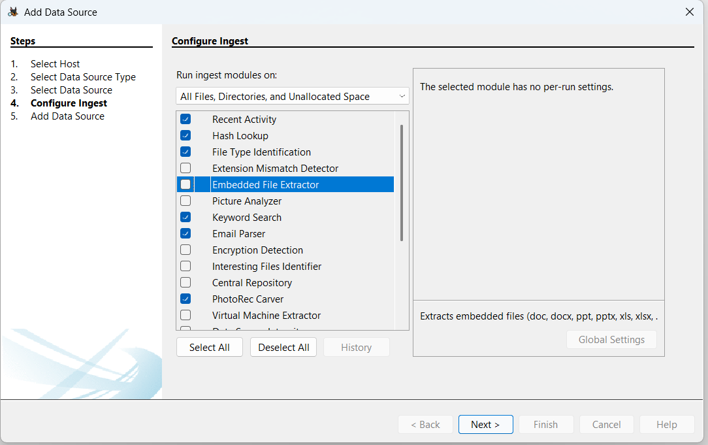
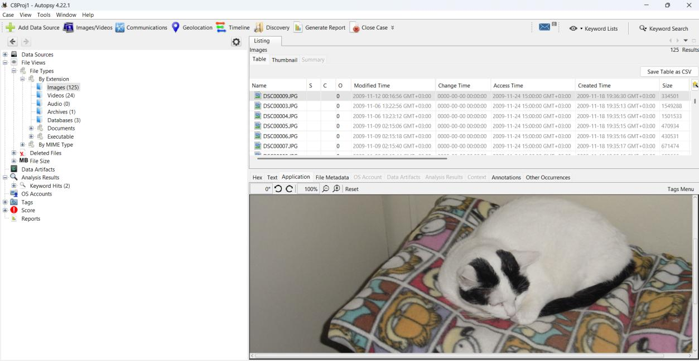
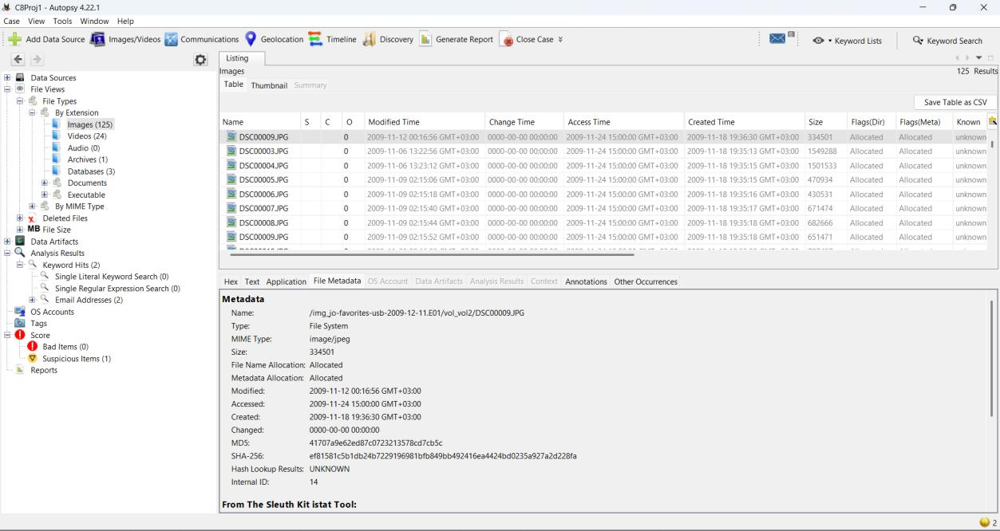
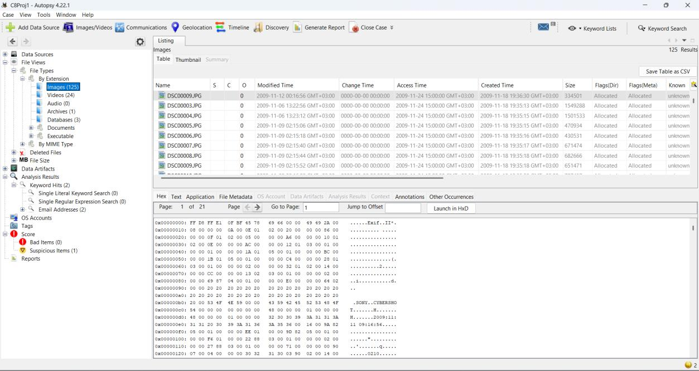
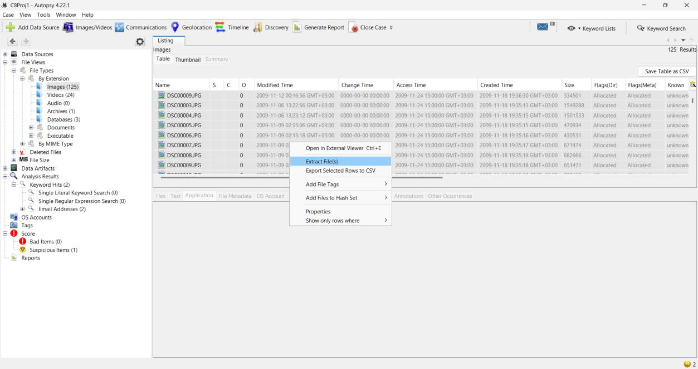
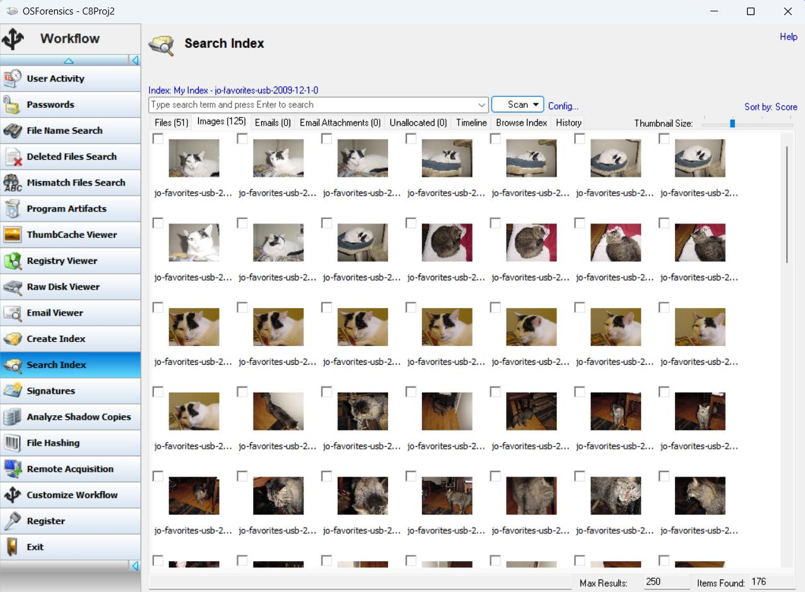
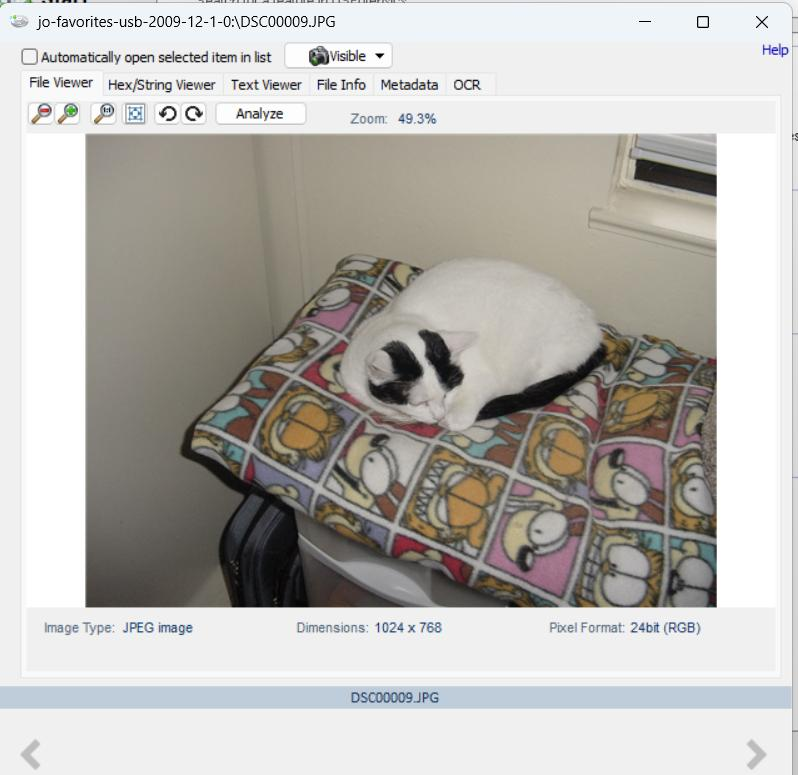
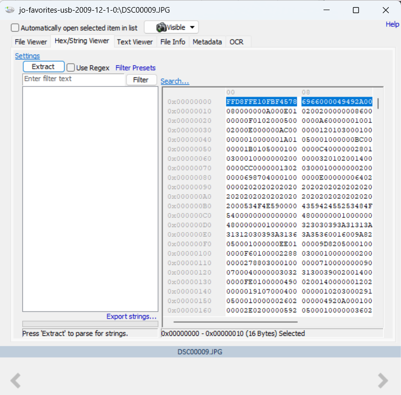
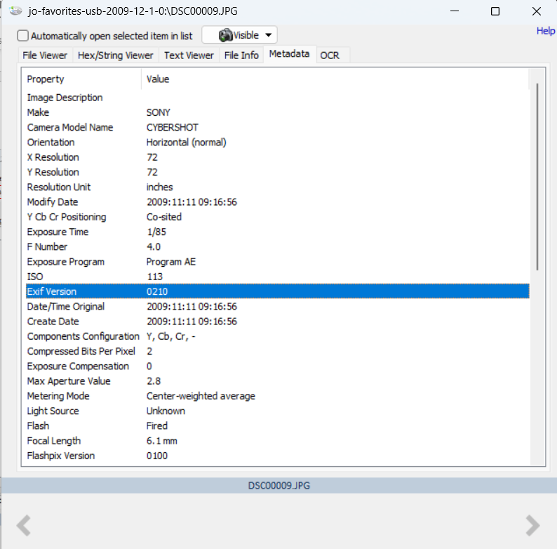

# Multimedia File Recovery and Analysis from an E01 Image

## Overview

This lab focused on recovering and analyzing image and video files from an E01 forensic image.

The evidence was examined using Autopsy and OSForensics. The analysis included file carving, file-system identification, deleted-file examination, JPEG signature validation, EXIF metadata analysis, video playback, and file export.

---

## Objectives

The main objectives were to:

- Load and examine an E01 forensic image.
- Identify the file system.
- Recover image and video files.
- Identify deleted multimedia files.
- Validate JPEG files using their file signatures.
- Examine EXIF metadata.
- Identify camera models.
- Review file hashes and timestamps.
- Compare findings from Autopsy and OSForensics.

---

## Evidence

| Item | Value |
|---|---|
| Evidence file | `jo-favorites-usb-2009-12-11.E01` |
| Evidence type | E01 forensic image |
| File system | FAT16 |
| Data examined | Images and videos |

---

## Tools Used

- Autopsy
- PhotoRec Carver
- OSForensics
- Windows File Properties
- Hex Viewer
- EXIF metadata viewer

---

# Autopsy Analysis

## Adding the Evidence

The E01 image was added to an Autopsy case as a data source.

Several ingest modules were enabled, including:

- PhotoRec Carver
- Hash Lookup
- Email Parser
- File Type Identification
- Recent Activity
- Keyword Search

---

## Image Examination

The recovered JPG files were reviewed under:

`Views → File Types → By Extension → Images`

The files were examined using the image preview, file properties, metadata view, and hex view.

---

## JPEG Signature Validation

One of the recovered JPG files started with the following hexadecimal signature:

`FF D8 FF E1`

The `FF D8 FF` bytes are consistent with the beginning of a JPEG file. The `E1` marker indicated that the file contained EXIF information.

---

## EXIF Metadata

The EXIF data contained information about the devices used to create the images.

Two camera models were identified:

- `SONY CYBERSHOT`
- `SONY HDR-SR10`

This information can help connect multimedia files to a particular camera or recording device.

---

## File Extraction

The identified image files were selected and extracted from the forensic image into the case export folder.

---

## Deleted Video Files

The Videos folder contained indicators showing that some files had been deleted.

A total of 12 deleted video files were identified. A video file was also opened in an external viewer to verify that its content could still be accessed.

---

# OSForensics Analysis

## Adding the Evidence Image

The same E01 image was added to an OSForensics case.

Partition 0 was selected to access the file-system data contained inside the image.

---

## Creating an Index

An index was created over the complete forensic image.

The index made it easier to search for and review multimedia files contained inside the evidence.

---

## Reviewing Indexed Images

The indexed images view was used to browse the picture files found in the evidence.

---

## File and Hex Analysis

`DSC00009.JPG` was examined using the File and Hex Viewer.

The analysis included:

- File information
- JPEG header
- EXIF metadata
- File timestamps
- Starting logical cluster number

The starting Logical Cluster Number for the file was:

`15,592`

---

## Video Analysis

OSForensics was used to identify and play video files stored in the forensic image.

Five QuickTime `.mov` files were identified.

The earliest video creation time found during the analysis was:

`2009-11-18 16:50:54`

This timestamp was associated with:

`TiggerTheCat.m4v`

The generated HTML report showed the creation time of `MontereyKitty.m4v` as:

`2009-11-20 09:28:22`

---

## Key Findings

| Finding | Result |
|---|---|
| File system | FAT16 |
| Deleted video files | 12 |
| Camera models | 2 |
| Camera model 1 | SONY CYBERSHOT |
| Camera model 2 | SONY HDR-SR10 |
| QuickTime `.mov` files | 5 |
| JPEG header | `FF D8 FF E1` |
| `DSC00009.JPG` starting LCN | 15,592 |
| Earliest video timestamp | `2009-11-18 16:50:54` |

---

## Forensic Value

This analysis demonstrated how multimedia files can provide useful forensic information.

Images and videos may contain:

- File signatures
- Creation and modification timestamps
- Camera information
- Device models
- File hashes
- Storage locations
- Deleted-file indicators
- Recoverable content

EXIF metadata may also help investigators associate an image with a particular camera or device.

---

## Tool Comparison

### Autopsy

Autopsy was useful for:

- Running multiple ingest modules.
- Carving files with PhotoRec.
- Identifying deleted files.
- Reviewing file hashes.
- Examining file metadata and hex data.
- Exporting recovered files.

### OSForensics

OSForensics was useful for:

- Indexing the complete evidence image.
- Browsing multimedia files.
- Viewing images and videos.
- Examining EXIF metadata.
- Reviewing file-system information.
- Generating an HTML report.

Using both tools helped validate the findings through more than one forensic application.

---

## Limitations

The presence of a file or metadata value does not explain the complete context of user activity.

Important findings should be correlated with:

- File-system metadata
- Hash values
- Application activity
- Operating-system artifacts
- Investigation timelines
- Additional evidence sources

Timestamps should also be interpreted using the correct timezone.

---

## Conclusion

The E01 forensic image contained recoverable image and video evidence.

Autopsy and OSForensics were used to identify the FAT16 file system, examine deleted video files, validate JPEG headers, review EXIF metadata, identify camera models, extract files, and analyze timestamps.

The lab demonstrated how file carving, metadata analysis, and cross-tool validation can support a multimedia forensic investigation.
