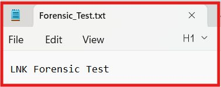
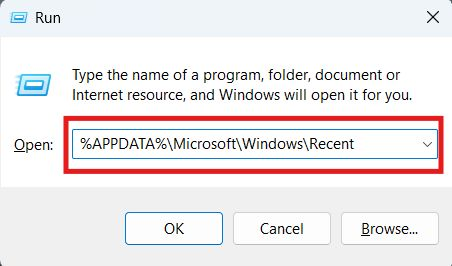
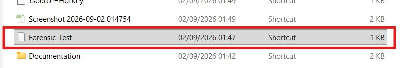
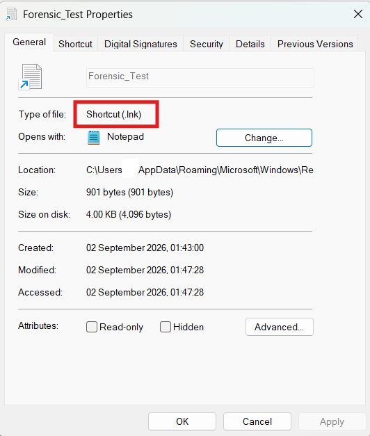
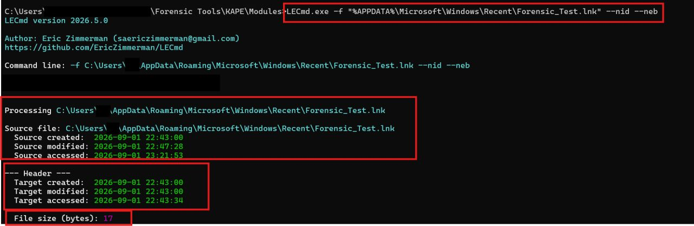

# Windows LNK File Analysis

## Objective

To examine a Windows shortcut file and identify forensic information about the original file, including its path and timestamps.

## Scenario

A text file named `Forensic_Test.txt` was created and opened on a Windows system. The generated LNK file was then examined to recover information about the original file.



## Evidence

- Artifact: `Forensic_Test.lnk`
- Artifact type: Windows Shortcut File
- Location: `%APPDATA%\Microsoft\Windows\Recent`

## Tool Used

**LECmd** by Eric Zimmerman was used to parse and examine the LNK file.







## Command Used

```cmd
LECmd.exe -f "%APPDATA%\Microsoft\Windows\Recent\Forensic_Test.lnk" --nid --neb
```

## Analysis Process

1. Located the LNK file in the Windows Recent folder.
2. Parsed the artifact using LECmd.
3. Reviewed the source and target timestamps.
4. Compared the shortcut metadata with the original file information.


## Findings

| Item | Created | Modified | Accessed |
|---|---|---|---|
| LNK Source | 2026-09-01 22:43:00 | 2026-09-01 22:47:28 | 2026-09-01 23:21:53 |
| Target File | 2026-09-01 22:43:00 | 2026-09-01 22:43:00 | 2026-09-01 22:43:34 |



