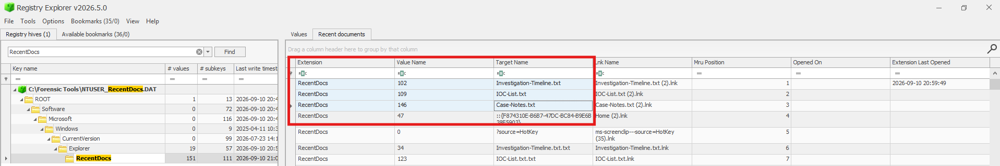

# Windows RecentDocs Artifact

## Overview

`RecentDocs` is a Windows Registry artifact that records references to documents the user recently interacted with.

It can help investigators identify file names and determine their relative order from the most recent to the oldest.

## Registry Location

`HKEY_CURRENT_USER\Software\Microsoft\Windows\CurrentVersion\Explorer\RecentDocs`

Windows also creates subkeys based on file extensions, such as `.txt`, `.pdf`, and `.docx`.

## Practice

For this practice, I created and opened three text files in the following order:

1. `Case-Notes.txt`
2. `IOC-List.txt`
3. `Investigation-Timeline.txt`

I then examined the `RecentDocs` artifact using Registry Explorer.

## Findings

The `Mru Position` column displayed the files from the most recent to the oldest:

| MRU Position | Target Name | Order |
|---|---|---|
| 1 | `Investigation-Timeline.txt` | Most recent |
| 2 | `IOC-List.txt` | Second |
| 3 | `Case-Notes.txt` | Oldest |

The files appeared in the reverse order in which they were opened, confirming how the Most Recently Used list works.

The lab files started at position `1` because another later file interaction occupied position `0`.

## Result

## Forensic Value

The `RecentDocs` artifact can help investigators:

- Identify recently accessed document names.
- Determine the relative order of user activity.
- Identify associated `.lnk` file names.
- Support timeline reconstruction.
- Correlate findings with LNK Files, Jump Lists, `$MFT`, and other artifacts.

## Important Note

`RecentDocs` provides evidence of user interaction with a document, but it should not be used alone to prove that the file was successfully opened or its contents were viewed.

## Tools Used

- Windows Registry Editor
- Registry Explorer

## Conclusion

This practice demonstrated how simple file activity can leave useful traces in the Windows Registry. Registry Explorer decoded the binary Registry data and clearly displayed the target file names, associated LNK names, and their MRU order.
